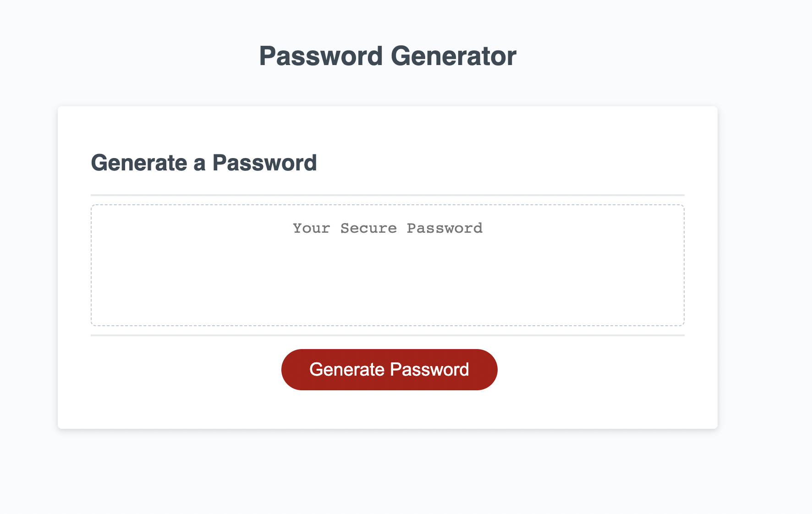
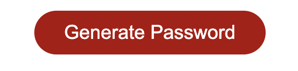
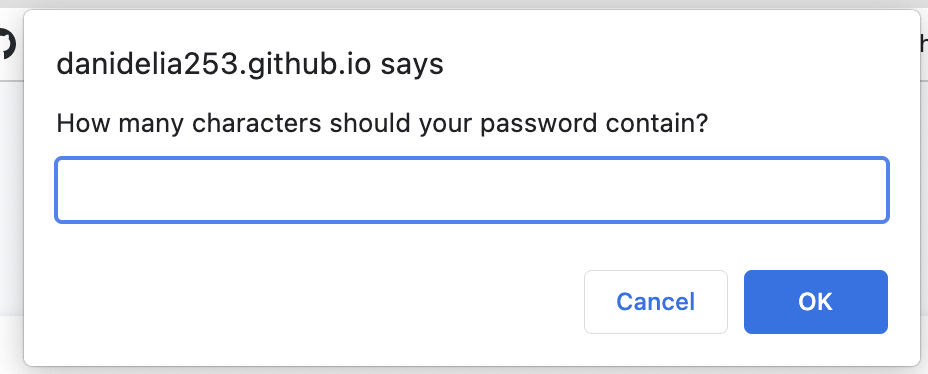
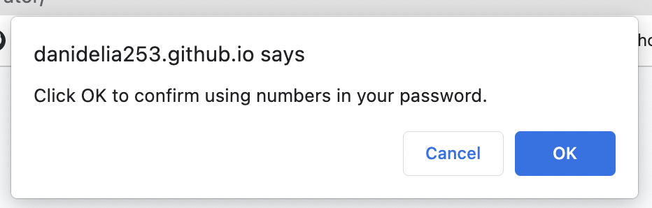
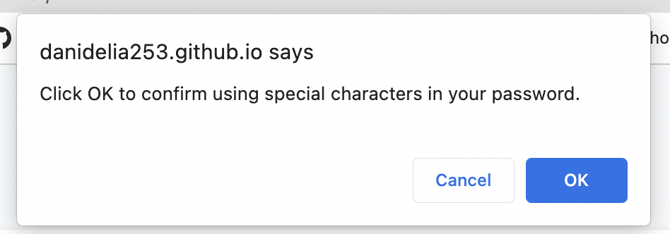
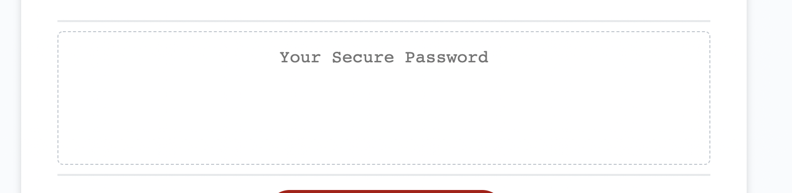

# Random Password Generator

## Description

This random password generator can be used to gnenerate a secure password that meets cartain criteria the user provides. When you push the generate button, you will be able to chose the length of your password, as well as if you;d like to include lowercase letters, uppercase letters, numbers and special characters. After making your selections, the password will be displayed on the screen to be copied and used for anything the user would like. 

[Link to the webpage of the deployed application](https://danidelia253.github.io/random-password-generator/)

[Project Repository](https://github.com/DaniDelia253/random-password-generator)

---

## Table of Contents

If your README is very long, add a table of contents to make it easy for users to find what they need, such as the following:

* [Usage](#usage)
* [Credits](#credits)

---

## Usage

Here is what the application looks like on page load:

* **Generate Button** starts the process of creating the password.
    

* **Password Length Prompt** is provided to get input from user about desired length of password.
    

* **Character Confirmation Prompts** a series of 4 confirmation statements confirm whwther the user wants to include lowercase letters, uppercase letters, numbers, and special characters in the password. User can confirm or cancel on each.
    * 
    * 
    * 
    * 

* The **Generated Password** will show in the text box when all prompts have been answered.
    

---

## Credits

Mock Up of example application page and starter code provided by Trinity Education Sercice © 2021 Trilogy Education Services, LLC, a 2U, Inc. brand. Confidential and Proprietary. All Rights Reserved.

[Project Repository](https://github.com/DaniDelia253/random-password-generator)

---